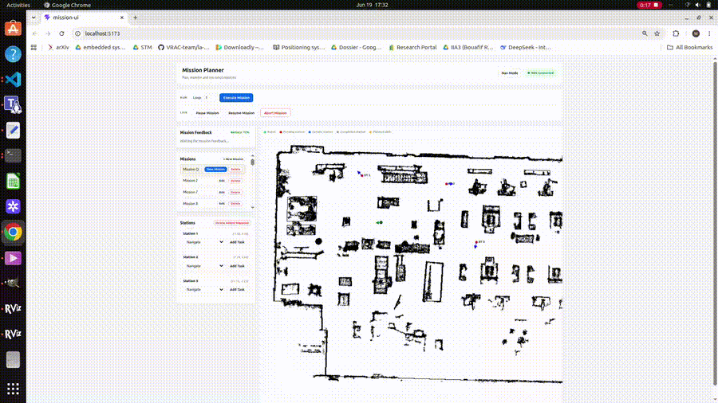
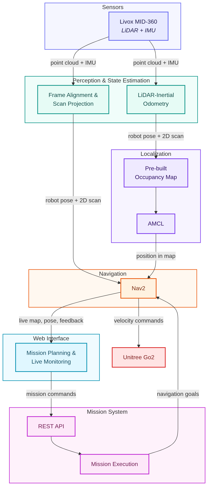

# Go2 CNIMI — Autonomous Navigation Stack

ROS 2 Humble autonomy stack for Unitree Go2 integrating LiDAR-inertial odometry, localization, navigation, and mission execution.

---

## Overview

Go2 CNIMI is an autonomous navigation stack developed for the Unitree Go2 Edu quadruped robot.

The system uses a Livox MID-360 LiDAR with FAST-LIO for LiDAR-inertial odometry. The estimated motion is integrated into a navigation pipeline combining AMCL localization with Nav2 navigation. The required map can be generated using either slam_toolbox or FAST-LIO (3D point cloud converted to an occupancy grid).

High-level mission execution is implemented through a ROS 2 action-based framework. A React web interface provides real-time mission planning, execution control, and live robot monitoring over WebSocket and REST.

---

## Architecture

  

---

## Technical Contributions

* Evaluated different odometry alternatives and deployed FAST-LIO as the primary odometry source.
* Developed the TF and sensor-processing pipeline connecting LiDAR odometry to the navigation stack.
* Configured and tuned Nav2 for quadruped in cluttered indoor environments: SMAC 2D global planner, MPPI local controller, local and global costmaps, velocity smoother, and collision monitor.
* Designed a ROS 2 action-based mission execution architecture with pause, resume, abort mission, and skip task controls.
* Developed the bringup architecture coordinating perception, localization, navigation, and mission layers.
* Built a React-based mission supervision interface with real-time streaming of robot pose, navigation path, and mission state over WebSocket (rosbridge), and REST-based command dispatch (execute, pause, resume, skip, abort) → [mission-planner-frontend](https://github.com/Unitree-Go2-CNIMI/mission-planner-frontend).

---

## Repository Structure

| Package | Role |
|---|---|
| `go2_bringup` | Launch file that starts the whole stack with staged timing |
| `go2_description` | Robot URDF and static TF publishing (`base_link` ↔ `livox_frame`, `utlidar_frame`) |
| `FAST_LIO_ROS2` | LiDAR-inertial odometry package|
| `go2_slam_toolbox` | SLAM-based mapping |
| `go2_navigation` | AMCL localization + Nav2, map storage |
| `go2_tf_utils` | Frame stabilization, point cloud → laser scan conversion, `odom → base_link` TF broadcasting |
| `go2_mission` | ROS 2 action server + REST API for autonomous waypoint missions |
| `go2_msgs` | Custom actions/services/messages shared across the stack |
| `navigation2` | Forked Nav2, modified to expose planner critic scores and separate reference vs. candidate trajectories for debugging |
| `unitree_ros2` | Unitree SDK/DDS interface layer |
| `mission-ui` | Web interface for planning and triggering missions |

## Setup

See [SETUP.md](assets/SETUP.md) for installation and configuration instructions.

---

## Scope

This repository contains the core autonomy software developed for the project.

Deployment-specific assets such as environment maps, network configuration, and company-specific integration components are excluded.

---

## Demo

